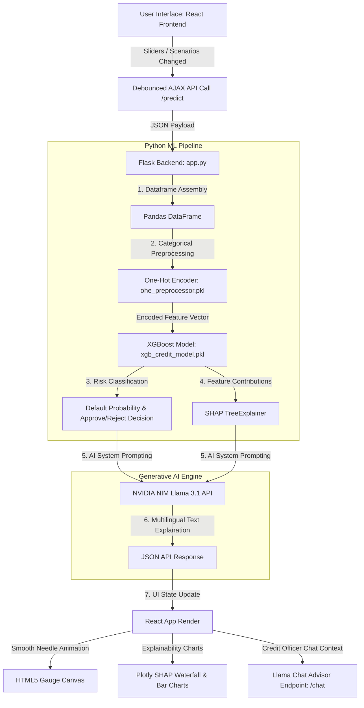

# Credit Risk StressLab 🧠💼

Credit Risk StressLab is an interactive, explainable, and AI-powered credit risk assessment and economic stress-testing platform. Unlike traditional "black-box" credit scoring applications, StressLab combines **XGBoost machine learning models**, **SHAP (SHapley Additive exPlanations)**, and **NVIDIA NIM-hosted Llama 3.1 GenAI** to provide transparent, human-readable, and multilingual credit risk insights in real-time.

---

## 🚀 What Makes It Different?

Most credit risk prediction applications simply return a credit score or a binary approve/reject decision. StressLab is built from the ground up to solve the transparency and stress-resilience problems in banking:

1. **Explainable AI (XAI) with SHAP**: For every single prediction, the model computes the exact contribution of each factor (e.g., CIBIL score, monthly income) using SHAP values. This translates complex mathematics into direct, visual proof of why a decision was reached.
2. **Economic Stress Testing (Shocks)**: Allows users to simulate macroeconomic scenarios—such as inflation surges, recessions, or job loss—in real-time. The application dynamically adjusts applicant inputs and instantly re-runs the machine learning pipeline to show how robust the applicant is under economic pressure.
3. **Generative AI Credit Advisor**: Integrates Llama 3.1 via NVIDIA NIM to draft clear, professional, and jargon-free credit reports. The UI includes an **interactive chat drawer** allowing non-technical users to ask follow-up questions (e.g., *"How can I improve my CIBIL score to get approved?"*).
4. **Multilingual Support (Hinglish/Hindi/English)**: Features an instant language translation toggle. Not only does the UI translate immediately, but the Llama 3.1 system prompt changes dynamically, forcing the AI Credit Advisor to write summaries and answer chat queries in the user's preferred language (including Hindi script and Romanized Hinglish).
5. **Real-time Auto-Calculation**: Using debounced event triggers, the system automatically posts updates to the ML backend as the user moves range sliders, providing a highly fluid, responsive, and game-like simulation interface.

---

## ⚠️ Real-World Noise Simulation vs. Data Leakage

A common pitfall in credit risk model development using synthetic datasets is **Data Leakage** and **Overfitting**, leading to an unrealistic 1.00 (100%) Accuracy and ROC-AUC score.

### The Overfitting Pitfall
In early versions of synthetic data generation, a clean, deterministic rule was accidentally created:
* Applicants with `Is_Default == 1` were given CIBIL scores strictly between 500 and 649.
* Applicants with `Is_Default == 0` were given CIBIL scores strictly between 700 and 850.

This created a perfect mathematical boundary. The XGBoost model immediately overfit to this leakage, learning a trivial single split (`CIBIL_Score > 650`) to achieve 100% accuracy without learning any real underlying risk patterns.

### The Real-World Fix: Introducing Noise
In production and real-world banking environments, perfect credit boundaries do not exist:
* Some **low CIBIL** applicants successfully repay their loans due to lifestyle changes, structural salary increases, or collateral.
* Some **high CIBIL** applicants suddenly default due to unexpected life events, job loss, or medical emergencies.

To capture this uncertainty, we intentionally introduced **20% noise/overlap** in our data generation pipeline. This overlap forces the XGBoost model to actually evaluate multiple features (monthly income, existing EMIs, employment status, housing type) in combination rather than relying on a single deterministic feature.

By doing so:
* The final model achieves a realistic, production-ready **ROC-AUC score of 0.75 - 0.85**.
* The model learns to capture real-world uncertainty, making it highly generalizable and robust for actual deployment.

---

## 📊 How It Works (Step-by-Step Flowchart)

The flowchart below visualizes how a user input travels through the frontend, gets processed by the Python machine learning stack, queries the LLM, and updates the reactive React dashboard:



---

## 🔑 Key Risk Factors Analysed

The underlying XGBoost classifier evaluates the applicant across 10 critical dimensions:

| Factor | Type | Impact Direction |
| :--- | :--- | :--- |
| **CIBIL Score** | Numeric (300-900) | Higher score exponentially reduces default risk. |
| **Monthly Income** | Numeric (INR) | Higher income increases credit capacity and reduces risk. |
| **Existing EMI** | Numeric (INR) | High debt-service obligations severely increase default probability. |
| **Loan Amount** | Numeric (INR) | Large loans relative to income increase default likelihood. |
| **Age** | Numeric (18-80) | Represents financial maturity and career stability. |
| **Tenure** | Numeric (Months) | Longer repayment timelines present higher cumulative risk. |
| **Employment Type** | Categorical | Skilled and highly skilled workers show lower default trends. |
| **Housing Type** | Categorical | Own-home ownership reduces risk compared to rented housing. |
| **Loan Purpose** | Categorical | Determines commercial vs. consumer consumption risk. |
| **Sex** | Categorical | Analyzes demographic credit trends within the historical dataset. |

---

## 🛠️ Step-by-Step Installation & Setup

Follow these steps to run Credit Risk StressLab on your local machine:

### 1. Prerequisites
Ensure you have **Python 3.9+** and **Node.js** installed on your system.

### 2. Clone and Prepare the Workspace
Extract the project code or navigate to the directory:
```bash
cd "Credit Risk  Stresslab"
```

### 3. Create a Virtual Environment & Install Dependencies
Create a Python virtual environment and install the required machine learning and web server packages:
```bash
# Create virtual environment
python -m venv venv

# Activate virtual environment
# On macOS/Linux:
source venv/bin/activate
# On Windows (Command Prompt):
venv\Scripts\activate.bat

# Install dependencies
pip install Flask pandas numpy scikit-learn shap joblib openai python-dotenv
```

### 4. Configure Your API Credentials
StressLab uses Llama 3.1 via the NVIDIA API. Create a `.env` file in the root directory and add your key:
```env
NVIDIA_API_KEY=your_nvidia_nim_api_key_here
```
*(If no API key is provided, the application will fallback to a default sandbox token or show "AI analysis unavailable", but the core ML model and charts will still run perfectly).*

### 5. Run the Server
Launch the Flask development server:
```bash
python app.py
```
The server will boot up on: **`http://127.0.0.1:5001`**

### 6. Access the App
Open your web browser and navigate to `http://127.0.0.1:5001`. 
*Note: If the page loads styled incorrectly, perform a hard reload (`Cmd + Shift + R` or `Ctrl + F5`) to force the browser to clear its cache.*

---

## 📖 Developer Reference & Technical Documentation

This section provides a structural review of the project files to assist in extending or maintaining the codebase.

### Backend: `app.py`
The backend Flask server is structured as follows:
* **Initialization (Lines 1-41)**: Reads environment variables securely, loads `xgb_credit_model.pkl` and `ohe_preprocessor.pkl` once, and initializes the `shap.TreeExplainer` context to save CPU overhead on incoming requests.
* **Prediction Route (`/predict`) (Lines 54-141)**:
  * Accepts a JSON payload representing applicant features.
  * Formats variables into a Pandas DataFrame and transforms them using the One-Hot Encoder pipeline.
  * Calls `model.predict_proba` to classify default risk.
  * Generates SHAP contribution values.
  * Constructs a custom prompt matching the selected language (`language` param: `hindi`/`hinglish`/`english`) and calls Llama 3.1 to generate a strict two-line summary.
  * Returns JSON containing the classification, default probability, SHAP values, and AI text summary.
* **Chat Advisor Route (`/chat`) (Lines 142-181)**:
  * Manages history-aware conversational context.
  * Receives previous chat history, current values, and current model decisions.
  * Sets up a system prompt directing Llama to act as a friendly bank advisor explaining risk metrics in plain, non-mathematical terms in the target language.

### Frontend: `static/app.js`
The user interface is built as a single-page React app:
* **Translations (Lines 10-103)**: A localized lookup dictionary containing all UI titles, placeholders, and charts descriptions.
* **Animations (`RiskGauge`) (Lines 105-168)**: Uses Canvas and `requestAnimationFrame` to smoothly animate the gauge needle and color transitions from the previous prediction score to the new score.
* **Explainability (`ShapWaterfall` & `DriverList`) (Lines 170-348)**: Harnesses **Plotly.js** to generate interactive waterfall contribution charts showing exactly which feature values increased or decreased risk.
* **State & Auto-calculation (Lines 438-512)**:
  * Manages current applicant inputs using React states.
  * A `useEffect` hook monitors state changes, debounces the user input for 450ms, and automatically sends POST requests to `/predict` without blocking or resetting UI states.
  * Evaluates macro stress presets and overrides input states.
