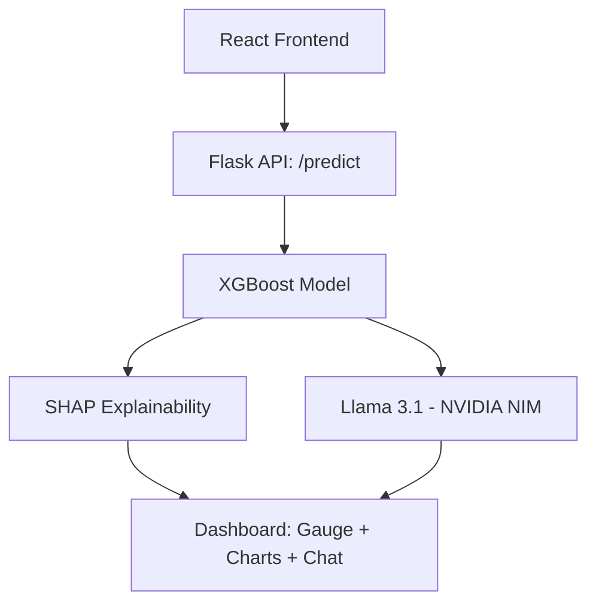

# Credit Risk StressLab 🧠💼

Credit Risk StressLab is an interactive, explainable, AI-powered credit risk assessment and economic stress-testing platform. It combines **XGBoost**, **SHAP (SHapley Additive exPlanations)**, and **NVIDIA NIM-hosted Llama 3.1 GenAI** to deliver transparent, human-readable, multilingual credit risk insights in real time.

---

## 🚀 Features

- **Explainable AI (SHAP)** — For every prediction, SHAP values show the exact contribution of each factor (e.g., CIBIL score, monthly income), turning the model into a transparent, auditable decision instead of a black box.
- **Economic Stress Testing** — Simulate macroeconomic scenarios (inflation, recession, job loss) and instantly see how applicant risk changes.
- **Generative AI Credit Advisor** — Llama 3.1 (via NVIDIA NIM) drafts jargon-free credit reports and answers follow-up questions through an interactive chat drawer.
- **Multilingual Support** — Instant UI and AI-response translation across English, Hindi, and Hinglish.
- **Real-time Auto-Calculation** — Debounced slider inputs trigger live re-predictions for a fluid, responsive experience.

---

## 📊 Architecture



---

## 🔑 Key Risk Factors

| Factor | Type | Impact |
| :--- | :--- | :--- |
| CIBIL Score | Numeric (300–900) | Higher score reduces default risk |
| Monthly Income | Numeric (INR) | Higher income reduces risk |
| Existing EMI | Numeric (INR) | High obligations increase risk |
| Loan Amount | Numeric (INR) | Larger loans relative to income increase risk |
| Age | Numeric (18–80) | Reflects financial maturity |
| Tenure | Numeric (Months) | Longer tenure = higher cumulative risk |
| Employment Type | Categorical | Skilled workers show lower default trends |
| Housing Type | Categorical | Home ownership reduces risk |
| Loan Purpose | Categorical | Commercial vs. consumer risk |
| Sex | Categorical | Demographic trend in historical data |

---

## 🛠️ Installation & Setup

### 1. Prerequisites
- Python 3.9+
- Node.js

### 2. Clone and Prepare
```bash
cd "Credit Risk  Stresslab"
```

### 3. Set Up Virtual Environment
```bash
python -m venv venv

# macOS/Linux
source venv/bin/activate
# Windows (Command Prompt)
venv\Scripts\activate.bat

pip install Flask pandas numpy scikit-learn shap joblib openai python-dotenv
```

### 4. Configure API Credentials
Create a `.env` file in the root directory:
```env
NVIDIA_API_KEY=your_nvidia_nim_api_key_here
```
*(Without a key, the app falls back to a sandbox token or shows "AI analysis unavailable" — the core ML model and charts still work.)*

### 5. Run the Server
```bash
python app.py
```
Server runs at **`http://127.0.0.1:5001`**

### 6. Access the App
Open `http://127.0.0.1:5001` in your browser. If styling looks off, hard reload (`Cmd+Shift+R` / `Ctrl+F5`).
